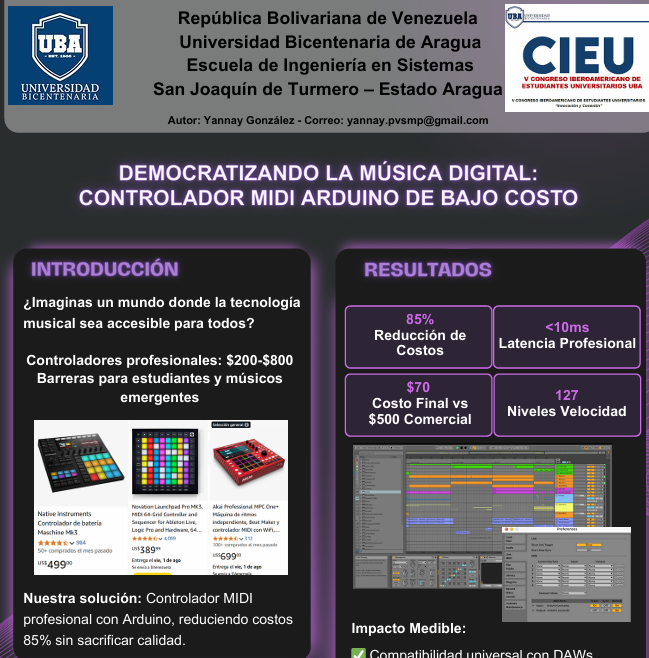
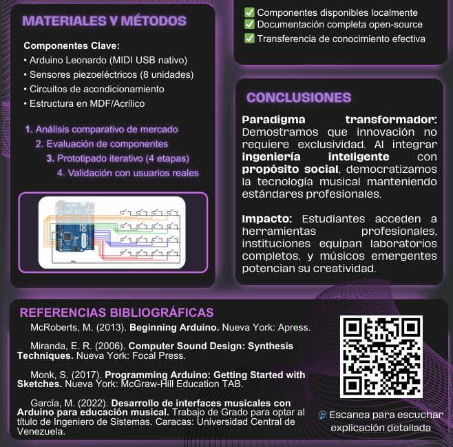
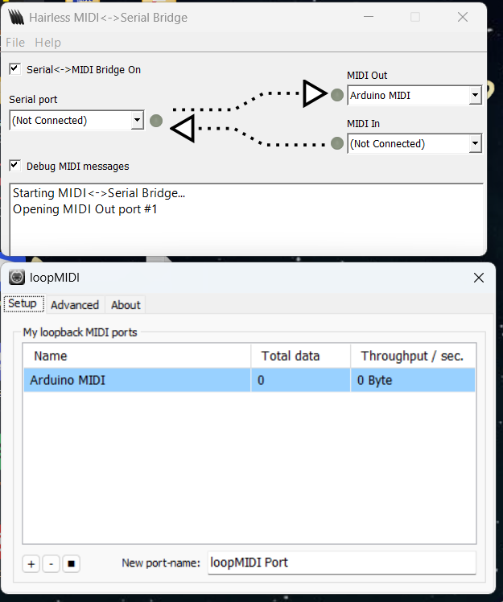
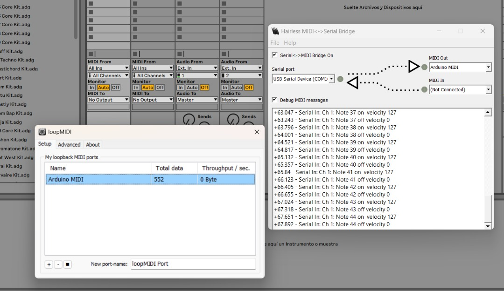
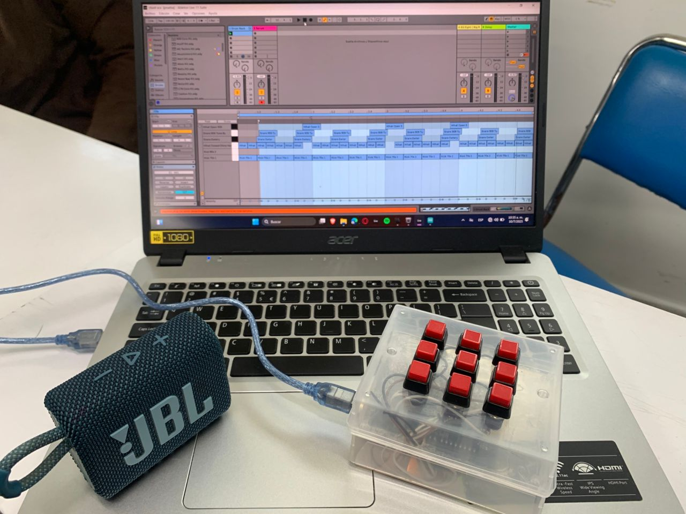
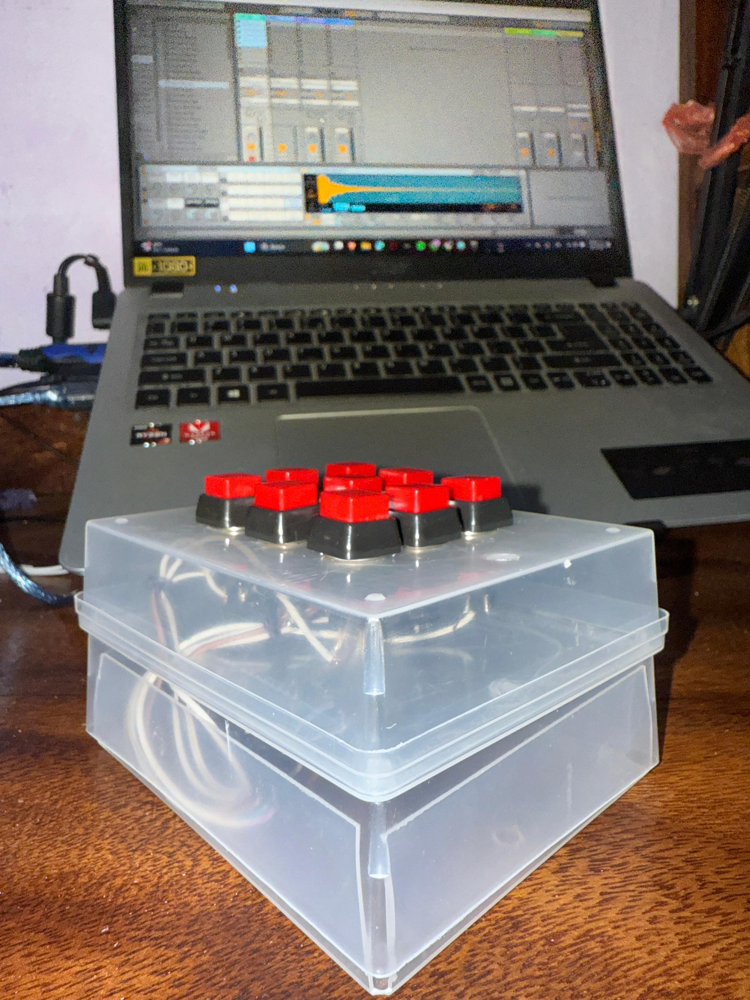
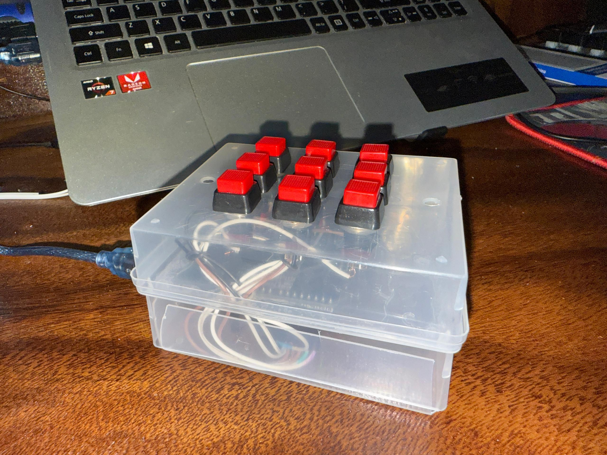
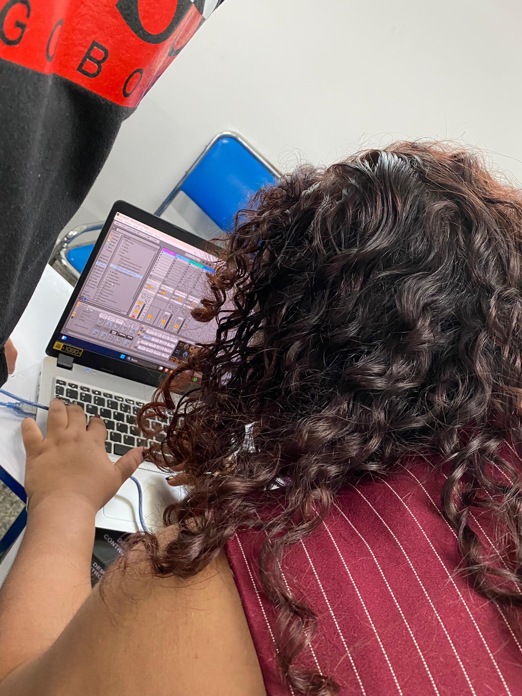

# Controlador MIDI con Arduino

Proyecto de investigacion aplicada desarrollado como trabajo de grado para optar al titulo de Ingeniero de Sistemas en la Universidad Bicentenaria de Aragua. El objetivo fue desarrollar un controlador MIDI tipo drumpad basado en Arduino como alternativa de bajo costo a los controladores comerciales, reduciendo el costo de acceso a tecnologia musical profesional en un 85%.

El proyecto fue presentado en el **V Congreso Iberoamericano de Estudiantes Universitarios UBA (CIEU)** bajo el titulo *"Democratizando la Musica Digital: Controlador MIDI Arduino de Bajo Costo"*.

---

## Vista Previa

### Poster del Congreso



### Configuracion de Software (LoopMIDI + Hairless MIDI)



### Presentacion






---

## Descripcion del Proyecto

El sistema consiste en un drumpad fisico construido con sensores piezoelectricos conectados a un Arduino, que captura las senales de golpe y las convierte en mensajes MIDI. Estos mensajes se envian al computador donde son interpretados por un DAW (Digital Audio Workstation) como Ableton Live.

### Resultado economico

| Aspecto | Valor |
|---|---|
| Costo del controlador desarrollado | $70 USD |
| Costo de controladores comerciales equivalentes | $200 - $800 USD |
| Reduccion de costo | 85% |
| Latencia obtenida | menos de 10ms |
| Niveles de velocidad MIDI | 127 |

---

## Implementacion Tecnica

### Hardware utilizado

El diseno original contemplaba un **Arduino Leonardo** o **Arduino Pro Micro** (con soporte MIDI USB nativo), pero dado que solo se disponia de un **Arduino UNO**, se adapto la solucion utilizando software auxiliar para la comunicacion MIDI.

| Componente | Descripcion |
|---|---|
| Arduino UNO | Microcontrolador principal (adaptacion del diseno original) |
| Sensores piezoelectricos | 8 unidades para deteccion de golpes |
| Circuitos de acondicionamiento | Filtrado y procesamiento de senal analogica |
| Estructura fisica | Construida en MDF y Acrilico |

### Software auxiliar necesario (por uso de Arduino UNO)

Debido a que el Arduino UNO no tiene soporte MIDI USB nativo, se requieren dos aplicaciones adicionales para que el controlador funcione con el DAW:

**1. loopMIDI**
Crea un puerto MIDI virtual en el sistema operativo.
Descarga: https://www.tobias-erichsen.de/software/loopmidi.html

**2. Hairless MIDI Serial Bridge**
Actua como puente entre el puerto serial del Arduino y el puerto MIDI virtual creado por loopMIDI.
Descarga: https://projectgus.github.io/hairless-midiserial/

### Configuracion paso a paso

1. Instalar loopMIDI y crear un puerto llamado "Arduino MIDI"
2. Instalar Hairless MIDI Serial Bridge
3. En Hairless: seleccionar el puerto serial del Arduino y el puerto MIDI de loopMIDI como salida
4. Abrir el DAW y seleccionar "Arduino MIDI" como dispositivo de entrada MIDI
5. Cargar el sketch en el Arduino y comenzar a usar el controlador

> Si se utiliza un Arduino Leonardo o Pro Micro, los pasos 1 y 2 no son necesarios ya que estos modelos aparecen directamente como dispositivo MIDI en el sistema.

---

## Codigo

El firmware esta desarrollado en C++ para Arduino IDE e implementa:

- Lectura de sensores piezoelectricos por pines analogicos
- Deteccion de umbral de activacion (threshold)
- Tecnica de debounce para evitar activaciones multiples por un solo golpe
- Envio de mensajes MIDI Note On / Note Off via puerto serial
- Mapeo de cada pad a una nota MIDI configurable (0-127)

---

## Compatibilidad con DAWs

Probado con:
- Ableton Live 11
- FL Studio (compatible)
- Cualquier DAW con soporte de entrada MIDI

---

## Tecnologias y Herramientas

| Herramienta | Uso |
|---|---|
| Arduino IDE | Desarrollo del firmware |
| C++ (Arduino) | Lenguaje de programacion del microcontrolador |
| loopMIDI | Puerto MIDI virtual en Windows |
| Hairless MIDI Serial Bridge | Puente serial-MIDI para Arduino UNO |
| Ableton Live 11 | DAW utilizado para pruebas |
| Protocolo MIDI 1.0 | Estandar de comunicacion musical |

---

## Estructura del Repositorio

```
MIDI-Arduino/
├── firmware/
│   └── arduino_midi.ino       # Codigo principal del Arduino
├── screenshots/               # Capturas del proyecto y presentacion
├── docs/
│   └── investigacion.docx
│   └── postercongreso.pdf     # Trabajo de investigacion aplicada completo + póster mostrado en el congreso
└── README.md
```

---

## Contexto Academico

Este proyecto forma parte de una investigacion aplicada estructurada en tres momentos, equivalente al primer avance de un trabajo de grado:

- **Momento 1 - Perspectiva de la Realidad**: Revision bibliografica, planteamiento del problema y propuesta
- **Momento 2 - Concrecion de las Ideas**: Analisis comparativo, diseno del sistema y fases de ejecucion
- **Momento 3 - Procedimientos Metodologicos**: Metodologia, planificacion, recursos y cronograma

Universidad Bicentenaria de Aragua — Escuela de Ingenieria de Sistemas — Mayo 2025

---

## Autor

**Yannay Gonzalez**
C.I. 28.456.191
Correo: yannay.pvsmp@gmail.com
GitHub: [@YannayG](https://github.com/YannayG)
